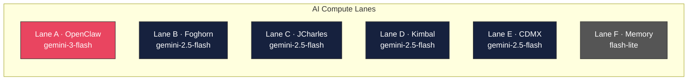
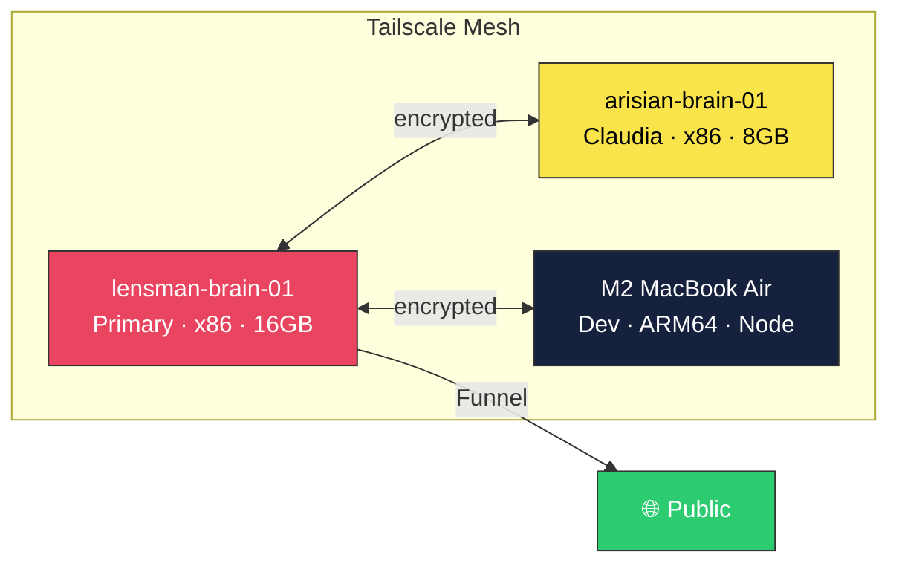

<div align="center">

# 🔧 Workshop

**A working toolbox for people who build things for small businesses.**

This isn't a framework. It's not a boilerplate. It's a workshop — the kind with a massive table in the middle, jigs hanging on the wall, a CNC machine in the corner, and sawdust on everything worth touching.

Every tool here is something I actually use. I picked each one for a reason. Some I've tried five alternatives before landing on. Some I stumbled into and never left. If you're building software for small business owners — solo, bootstrapped, or just stubborn — pull up a stool and look around.

[](.)
[](.)
[](.)

</div>

---

## The Bench

<div align="center">

</div>

<br/>

```json
{
  "stack": "OpenClaw",
  "intel": ["Antfarm", "OpenNotebook"],
  "data": ["SQLite", "Redis", "SurrealDB+MCP"],
  "delivery": ["n8n", "Listmonk", "Relay"],
  "logic": "Polyglot_Capsules"
}
```

---

## 🧰 The Tools

Every project in this stack is open source. I don't use anything I can't fix, fork, or walk away from. Here's what's on the wall and why.

---

<!-- TOOL: OpenClaw -->
> ### 🦞 [OpenClaw](https://openclaw.ai)
> **The Executive Assistant — "Jarvis"**
>
> |  |  |
> |--|--|
> | **What it is** | AI gateway + dispatch. Every instruction flows through here. |
> | **Role in the stack** | Command layer. Single point of contact for the entire system. |
> | **Why it won** | <!-- ✏️ YOUR TAKE HERE — what made you choose OpenClaw over alternatives? What did you try first? What do you wish it did better? --> *[Placeholder: Your personal take goes here. Why OpenClaw and not LangChain? What sealed the deal?]* |
> | **The catch** | <!-- ✏️ YOUR TAKE — every tool has one. Ken Rockwell always mentions the flaw. --> *[Placeholder: What's the one thing that drives you crazy about it?]* |
>
> **Used for:** Routing tasks to AI models, managing conversation memory, dispatching work to the swarm.

---

<!-- TOOL: n8n -->
> ### ⚡ [n8n](https://n8n.io)
> **The Workflow Automation Engine — "The CNC Machine"**
>
> |  |  |
> |--|--|
> | **What it is** | Visual workflow automation. Webhooks, schedules, data transforms, API glue. |
> | **Role in the stack** | Delivery layer. The thing that actually *moves* data from point A to point B. |
> | **Why it won** | <!-- ✏️ YOUR TAKE --> *[Placeholder: Why n8n over Zapier or Make? What made you trust it with production workflows?]* |
> | **The catch** | <!-- ✏️ YOUR TAKE --> *[Placeholder: The honest downside.]* |
>
> **Used for:** Triggering email campaigns, webhook relay, data pipeline automation, scheduled jobs.

---

<!-- TOOL: Listmonk -->
> ### 📬 [Listmonk](https://listmonk.app)
> **The Newsletter Engine — "The Save-A-Day Sander"**
>
> |  |  |
> |--|--|
> | **What it is** | Self-hosted newsletter and mailing list manager. Fast, clean, no monthly fees per subscriber. |
> | **Role in the stack** | Delivery layer. Handles subscriber lists, campaigns, transactional email. |
> | **Why it won** | <!-- ✏️ YOUR TAKE --> *[Placeholder: Why self-hosted email? What did Mailchimp/ConvertKit cost you? What's different about owning your list?]* |
> | **The catch** | <!-- ✏️ YOUR TAKE --> *[Placeholder: The honest downside.]* |
>
> **Used for:** Client newsletters, drip campaigns, transactional email via `newsletter.jcharlesassets.com`.

---

<!-- TOOL: SurrealDB -->
> ### 🔮 [SurrealDB](https://surrealdb.com)
> **The Knowledge Graph — "The Massive Table"**
>
> |  |  |
> |--|--|
> | **What it is** | Multi-model database: document, graph, relational, key-value — all in one. MCP-native. |
> | **Role in the stack** | Data layer. Stores brand kits, client data, knowledge graphs. MCP-accessible from any agent. |
> | **Why it won** | <!-- ✏️ YOUR TAKE --> *[Placeholder: What made you pick SurrealDB over Postgres or Mongo? What clicked?]* |
> | **The catch** | <!-- ✏️ YOUR TAKE --> *[Placeholder: The honest downside.]* |
>
> **Used for:** Brand kit storage, client relationship data, MCP-queryable knowledge base.

---

<!-- TOOL: Redis -->
> ### 🔴 [Redis](https://redis.io)
> **The Message Bus — "The Dust Handler"**
>
> |  |  |
> |--|--|
> | **What it is** | In-memory data store. Pub/sub, caching, session state, rate limiting. |
> | **Role in the stack** | Data layer (real-time). The nervous system. Every event passes through Redis. |
> | **Why it won** | <!-- ✏️ YOUR TAKE --> *[Placeholder: What does Redis do for you that nothing else can? Speed? Simplicity? The pub/sub?]* |
> | **The catch** | <!-- ✏️ YOUR TAKE --> *[Placeholder: The honest downside.]* |
>
> **Used for:** Agent pub/sub messaging, session cache, rate limit tracking, OpenClaw memory plugin.

---

<!-- TOOL: Supabase -->
> ### 🟢 [Supabase](https://supabase.com)
> **The Backend-as-a-Service — "The Jig"**
>
> |  |  |
> |--|--|
> | **What it is** | Open-source Firebase alternative. Postgres, Auth, Storage, Edge Functions — self-hosted. |
> | **Role in the stack** | Auth + storage + relational data. The production backbone. |
> | **Why it won** | <!-- ✏️ YOUR TAKE --> *[Placeholder: Why self-hosted Supabase? What did Firebase lack? What was the migration like?]* |
> | **The catch** | <!-- ✏️ YOUR TAKE --> *[Placeholder: 12 containers is a lot of containers.]* |
>
> **Used for:** User auth, PostgreSQL, file storage, real-time subscriptions.

---

<!-- TOOL: Archon / OpenNotebook -->
> ### 📓 [OpenNotebook](https://github.com/lfg-seth/open-notebook) + [Archon](https://github.com/coleam00/archon)
> **The Research Desk — "The Reference Library"**
>
> |  |  |
> |--|--|
> | **What it is** | RAG-powered research and knowledge retrieval. 531 vectorized sources. |
> | **Role in the stack** | Intelligence layer. When the AI needs to *know* something, it asks here. |
> | **Why it won** | <!-- ✏️ YOUR TAKE --> *[Placeholder: What's it like having your entire codebase searchable by AI? What changed when you set this up?]* |
> | **The catch** | <!-- ✏️ YOUR TAKE --> *[Placeholder: The honest downside.]* |
>
> **Used for:** Codebase search, documentation retrieval, contextual AI grounding.

---

<!-- TOOL: NocoDB -->
> ### 📊 [NocoDB](https://nocodb.com)
> **The CRM — "The Parts Organizer"**
>
> |  |  |
> |--|--|
> | **What it is** | Open-source Airtable alternative. Turns any database into a smart spreadsheet. |
> | **Role in the stack** | Client management. The human-readable view of your data. |
> | **Why it won** | <!-- ✏️ YOUR TAKE --> *[Placeholder: Why not just use Airtable? What does self-hosting the CRM buy you?]* |
> | **The catch** | <!-- ✏️ YOUR TAKE --> *[Placeholder: The honest downside.]* |
>
> **Used for:** Contact management, deal tracking, client pipeline — port 8585.

---

<!-- TOOL: Tailscale -->
> ### 🔒 [Tailscale](https://tailscale.com)
> **The Network Mesh — "The Workshop Walls"**
>
> |  |  |
> |--|--|
> | **What it is** | Zero-config VPN mesh. WireGuard under the hood. Encrypted connections between all devices. |
> | **Role in the stack** | Infrastructure. Every server, laptop, and container talks through Tailscale. |
> | **Why it won** | <!-- ✏️ YOUR TAKE --> *[Placeholder: What was networking like before Tailscale? What's the Funnel feature worth to you?]* |
> | **The catch** | <!-- ✏️ YOUR TAKE --> *[Placeholder: The honest downside.]* |
>
> **Used for:** Encrypted mesh between `lensman-brain-01`, `arisian-brain-01`, M2 MacBook. Funnel for public access.

---

## 🤖 AI Compute — 6 Lanes, Zero Contention

The equivalent of having six workbenches and never waiting for one to free up.



| Lane | Owner | Default Model | Fallback |
|------|-------|--------------|----------|
| **A** | OpenClaw | gemini-3-flash | claude-opus-4.6 → kimi-k2.5 |
| **B** | Foghorn | gemini-2.5-flash | gemini-2.5-pro |
| **C** | JCharles | gemini-2.5-flash | gemini-2.5-pro |
| **D** | Kimbal | gemini-2.5-flash | gemini-2.5-pro |
| **E** | CDMX | gemini-2.5-flash | gemini-2.5-pro |
| **F** | Agent Memory | gemini-2.0-flash-lite | — |

**Total cost of AI compute: $0.** All via Google OAuth free tier.

---

## 🏗️ The Shop Floor



| Resource | Lensman | Cuarzos |
|----------|---------|----------|
| **Provider** | Hetzner Cloud | Hetzner Cloud |
| **CPU** | AMD EPYC-Genoa, 4c | AMD, 4c |
| **RAM** | 16 GB + 4 GB swap | 8 GB + 4 GB swap |
| **Disk** | 150 GB SSD | 75 GB SSD |
| **Monthly** | ~€20 total |  |

---

## 📋 What's Running

### Lensman (Factory)

| Tool | Status | Notes |
|------|--------|-------|
| OpenClaw Gateway | ✅ Live | Dockerized, HTTPS via Tailscale Serve |
| Agent Memory Server | ✅ Live | Redis-backed, port 8055 |
| Gemini Swarm (×5) | ✅ Live | Foghorn, JCharles, Kimbal, CDMX, Claudia |
| Redis Stack | ✅ Live | RediSearch + RedisJSON |
| OpenNotebook | ✅ Live | 531 vectorized sources |
| n8n | ✅ Live | Automation hub, port 5678 |
| Antfarm | ✅ Live | Dashboard on port 3333 |
| Listmonk | 🟡 Needs SMTP relay | Evaluating: Postal · Amazon SES · Mailgun |
| MacBook Node | ✅ Paired | `system.run` · `browser` · `system.which` |

### Cuarzos (Production)

| Tool | Status | Notes |
|------|--------|-------|
| Supabase | ✅ Live | 12 containers, Postgres + Auth + Storage |
| NocoDB | ✅ Live | CRM, port 8080 |
| SurrealDB | ✅ Live | MCP-accessible, port 8000 |
| Archon | ✅ Live | MCP + Agents + Work Orders |
| Cuarzos OS (3-X) | ✅ Live | `lensmen.jcharlesassets.com` |
| RabbitMQ | ✅ Live | Message broker |
| Caddy Gateway | ✅ Live | TLS + reverse proxy |
| Studio | 📐 Design | [doc-rogers/studio](https://github.com/doc-rogers/studio) |

---

## 📂 In This Repo

| File | What It Covers |
|------|---------------|
| [`README.md`](README.md) | This file — the workshop tour |
| [`stack-architecture.md`](stack-architecture.md) | Deep dive into every layer |
| [`roadie-protocol.md`](roadie-protocol.md) | Infrastructure agent: health checks, safety rules, procedures |
| [`compute-map.nu`](compute-map.nu) | Executable compute allocation (Nushell) |

---

## Related Shops

| Repo | What's Inside |
|------|--------------|
| [doc-rogers/studio](https://github.com/doc-rogers/studio) | AI-powered brand design tool |
| [doc-rogers/lens](https://github.com/doc-rogers/lens) | Core monorepo |

---

<div align="center">

**€20/mo. Free AI compute. Open source everything.**

*A workshop is only as good as the person using it.*
*But it helps to have good tools.* 🔧

</div>
