<div align="center">

# 🔧 Workshop

**The Lensmen Stack — architecture, protocols, and compute allocation.**

Infrastructure documentation for the entire platform.

[](.)
[](.)
[](.)
[](.)

</div>

---

## The Stack

<div align="center">

</div>

```json
{
  "stack": "OpenClaw",
  "intel": ["Antfarm", "OpenNotebook"],
  "data": ["SQLite", "Redis", "SurrealDB+MCP"],
  "delivery": ["n8n", "Listmonk", "Relay"],
  "logic": "Polyglot_Capsules",
  "infra": { "provider": "Hetzner", "ram_gb": 8 }
}
```

---

## Layer Map

```mermaid
graph TB
    subgraph CMD["🎯 COMMAND"]
        OC["OpenClaw<br/><i>Jarvis</i>"]
    end

    subgraph INTEL["🧠 INTELLIGENCE"]
        AF["Antfarm<br/><i>Worker Bees</i>"]
        ON["OpenNotebook<br/><i>Research</i>"]
    end

    subgraph DATA["💾 DATA"]
        SQ["SQLite"]
        RD["Redis"]
        SR["SurrealDB + MCP"]
    end

    subgraph DELIVERY["📬 DELIVERY"]
        N8["n8n"]
        LM["Listmonk"]
        RL["Relay"]
    end

    subgraph LOGIC["⚡ LOGIC"]
        PC["Polyglot Capsules<br/><i>TS · Python · Nushell</i>"]
    end

    subgraph INFRA["🏗️ INFRA"]
        HZ["Hetzner · 8GB · €20/mo"]
    end

    OC -->|dispatches| AF
    OC -->|queries| ON
    OC -->|reads/writes| DATA
    AF -->|executes| PC
    ON -->|indexes| SR
    PC -->|triggers| N8
    N8 -->|sends| LM
    LM -->|delivers| RL

    style OC fill:#e94560,stroke:#333,color:#fff
    style AF fill:#16213e,stroke:#333,color:#fff
    style ON fill:#16213e,stroke:#333,color:#fff
    style SQ fill:#2ecc71,stroke:#333,color:#fff
    style RD fill:#2ecc71,stroke:#333,color:#fff
    style SR fill:#2ecc71,stroke:#333,color:#fff
    style N8 fill:#8e44ad,stroke:#333,color:#fff
    style LM fill:#8e44ad,stroke:#333,color:#fff
    style RL fill:#8e44ad,stroke:#333,color:#fff
    style PC fill:#f9e44c,stroke:#333,color:#000
    style HZ fill:#555,stroke:#333,color:#fff
```



---

## AI Compute — 6 Lanes, Zero Contention

| Lane | Owner | OAuth Account | Default Model |
|------|-------|--------------|---------------|
| **A** | OpenClaw | `jamesrogers@jcharlesassets.com` | gemini-3-flash |
| **B** | Foghorn | `foghornbullhorn@gmail.com` | gemini-2.5-flash |
| **C** | JCharles | `cuarzosclaudia@gmail.com` | gemini-2.5-flash |
| **D** | Kimbal | `kimbal.arisian@gmail.com` | gemini-2.5-flash |
| **E** | CDMX | `elem.agiqua@gmail.com` | gemini-2.5-flash |
| **F** | Agent Memory | AI Studio API Key | gemini-2.0-flash-lite |

### Task Size Cascade


**Bonus:** Antigravity OAuth also unlocks `claude-opus-4-5-thinking` and `claude-sonnet-4-5` (80% quota remaining).

---

## Server Fleet


---

## Container Inventory

| Port | Container | Stack | Status |
|------|-----------|-------|--------|
| 3001 | `lensmen-ui` | Lensmen | ✅ |
| 8000 | `lensmen-daemon` | Lensmen | ✅ |
| 8181 | `archon-server` | Archon | ✅ |
| 8051 | `archon-mcp` | Archon | ✅ |
| 8052 | `archon-agents` | Archon | ✅ |
| 8053 | `archon-agent-work-orders` | Archon | ✅ |
| 5173 | `archon-ui-standalone` | Archon | ✅ |
| 8502 | `lensman-notebook` | Tools | ✅ |
| 8585 | `lensman-crm` | Tools | ✅ |
| 5678 | `n8n` | Tools | 🟡 |
| 6379 | `lensman-pulse` | Tools | ✅ |
| — | Supabase (×12) | Supabase | ✅ |

---

## What's Live vs Inbound


| Component | Status | Notes |
|-----------|--------|-------|
| OpenClaw | ✅ Live | Antigravity OAuth |
| Gemini Swarm (×5) | ✅ Live | Foghorn, JCharles, CDMX, Kimbal, Claudia |
| Redis | ✅ Live | Memory plugin active |
| OpenNotebook | ✅ Live | 531 vectorized sources |
| Supabase | ✅ Live | 12 containers |
| NocoDB (CRM) | ✅ Live | Port 8585 |
| SurrealDB | ✅ Live | Ports 8000/8001 |
| n8n | 🟡 Needs Plumbing | Not wired to delivery |
| Listmonk | 🟡 Needs Rollup | Not yet deployed |
| Relay (SMTP) | 🟡 Needs Rollup | newsletter.jcharlesassets.com |
| Antfarm | 🟡 Needs Rollup | Worktree isolation |
| Studio | 📐 Design Phase | [doc-rogers/studio](https://github.com/doc-rogers/studio) |

---

## 📂 Documentation

| File | What It Covers |
|------|---------------|
| [`README.md`](README.md) | This file — full stack overview |
| [`stack-architecture.md`](stack-architecture.md) | Deep dive into every layer |
| [`roadie-protocol.md`](roadie-protocol.md) | Infrastructure agent spec + procedures |
| [`compute-map.nu`](compute-map.nu) | Executable compute allocation (Nushell) |

---

## Related Repos

| Repo | Purpose |
|------|---------|
| [doc-rogers/studio](https://github.com/doc-rogers/studio) | AI-powered brand design tool |
| [doc-rogers/lens](https://github.com/doc-rogers/lens) | Core monorepo |

---

<div align="center">

**€20/mo Hetzner VPS. Free AI compute. Six dedicated lanes. Zero contention.**

*One unified force moving indelibly into the future.* 🎸

</div>
