# Lensmen Stack — Full Architecture

> The unified system. Who gets what. Where the data flows. What powers what.

<div align="center">

</div>

---

## Stack Overview

```json
{
  "stack": "OpenClaw",
  "intel": ["Antfarm", "OpenNotebook"],
  "data": ["SQLite", "Redis", "SurrealDB+MCP"],
  "delivery": ["n8n", "Listmonk", "Relay"],
  "logic": "Polyglot_Capsules",
  "infra": { "provider": "Hetzner", "ram_gb": 8 }
}
```

---

## Layer Map

```mermaid
graph TB
    subgraph CMD["🎯 COMMAND"]
        OC["OpenClaw<br/><i>Executive Assistant · Jarvis</i>"]
    end

    subgraph INTEL["🧠 INTELLIGENCE"]
        AF["Antfarm<br/><i>Worker Bee Deployment</i>"]
        ON["OpenNotebook<br/><i>Research · RAG</i>"]
    end

    subgraph DATA["💾 DATA"]
        SQ["SQLite<br/><i>Local State</i>"]
        RD["Redis<br/><i>Pub/Sub · Cache</i>"]
        SR["SurrealDB + MCP<br/><i>Knowledge Graph</i>"]
    end

    subgraph DELIVERY["📬 DELIVERY"]
        N8["n8n<br/><i>Workflow Automation</i>"]
        LM["Listmonk<br/><i>Newsletter Engine</i>"]
        RL["Relay<br/><i>SMTP Transport</i>"]
    end

    subgraph LOGIC["⚡ LOGIC"]
        PC["Polyglot Capsules<br/><i>TypeScript · Python · Nushell</i>"]
    end

    subgraph INFRA["🏗️ INFRASTRUCTURE"]
        HZ["Hetzner VPS<br/><i>8 GB RAM · 4 cores · €20/mo</i>"]
    end

    OC -->|dispatches tasks| AF
    OC -->|queries knowledge| ON
    OC -->|reads/writes| DATA
    AF -->|executes| PC
    ON -->|indexes into| SR
    PC -->|triggers| N8
    N8 -->|sends via| LM
    LM -->|delivers via| RL
    DATA -->|persists on| HZ
    DELIVERY -->|runs on| HZ
    LOGIC -->|runs on| HZ

    style OC fill:#e94560,stroke:#333,color:#fff
    style AF fill:#16213e,stroke:#333,color:#fff
    style ON fill:#16213e,stroke:#333,color:#fff
    style SQ fill:#2ecc71,stroke:#333,color:#fff
    style RD fill:#2ecc71,stroke:#333,color:#fff
    style SR fill:#2ecc71,stroke:#333,color:#fff
    style N8 fill:#8e44ad,stroke:#333,color:#fff
    style LM fill:#8e44ad,stroke:#333,color:#fff
    style RL fill:#8e44ad,stroke:#333,color:#fff
    style PC fill:#f9e44c,stroke:#333,color:#000
    style HZ fill:#555,stroke:#333,color:#fff
```



---

## 🎯 COMMAND — OpenClaw

The executive assistant. Jarvis. Every instruction flows through here.

| Attribute | Detail |
|-----------|--------|
| **Role** | Executive assistant + orchestrator |
| **Interface** | WhatsApp · CLI · Tailscale WebSocket |
| **Default Model** | `gemini-3-flash` (Antigravity OAuth) |
| **Fallbacks** | `gemini-3-pro-high` → `kimi-k2.5-free` |
| **Personality** | Custom system prompt with memory |
| **Memory** | Redis-backed persistent memory |
| **Plugins** | `redis-memory`, MCP servers |

OpenClaw is the **single point of contact**. You talk to OpenClaw. OpenClaw talks to everything else.

---

## 🧠 INTELLIGENCE — Antfarm + OpenNotebook

### Antfarm (Worker Bees)

The deployment layer. Tasks that OpenClaw dispatches get executed here.

| Attribute | Detail |
|-----------|--------|
| **Role** | Parallel task execution |
| **Runtime** | GitHub worktrees (isolated branches) |
| **Blast Radius** | Limited — each worktree is sandboxed |
| **Workers** | Gemini CLI containers (Foghorn, JCharles, CDMX, Kimbal, Claudia) |
| **Coordination** | Redis pub/sub for task assignment |

> *Worktree isolation is the answer to "23 containers lost in one night."*
> Each ant works in its own sandbox. When one crashes, the others keep running.

### OpenNotebook

| Attribute | Detail |
|-----------|--------|
| **Role** | Research + RAG + knowledge retrieval |
| **Port** | 8502 |
| **Backend** | Archon (531 vectorized sources) |
| **Sources** | lensman-os, n8n, supabase, nocodb, Instagram SGM |

---

## 💾 DATA — SQLite + Redis + SurrealDB

Three databases, three jobs. No overlap.


| Database | Role | Access Pattern |
|----------|------|---------------|
| **SQLite** | Local agent state, config, task queues | Direct file I/O |
| **Redis** | Pub/sub, cache, session state, rate limits | TCP (port 6379) |
| **SurrealDB** | Knowledge graph, brand kits, client data | MCP + HTTP API |

---

## 📬 DELIVERY — n8n + Listmonk + Relay

The outbound pipeline. Content → automation → email → delivery.


| Service | Port | Status | Role |
|---------|------|--------|------|
| **n8n** | 5678 | 🟡 Inbound (needs plumbing) | Workflow automation |
| **Listmonk** | — | 🟡 Inbound (needs rollup) | Newsletter / email engine |
| **Relay** | 25/587 | 🟡 Inbound (needs rollup) | SMTP relay transport |

> These three still need to get plumbed correctly into the unified stack.

---

## ⚡ LOGIC — Polyglot Capsules

Self-contained units of work that can be written in any language.

| Language | Use Case | Example |
|----------|----------|---------|
| **TypeScript** | API routes, UI logic, MCP tools | Studio API route, brand kit CRUD |
| **Python** | ML pipelines, data processing, FastAPI | Archon RAG, daemon |
| **Nushell** | Infrastructure scripts, data transforms | `compute-map.nu`, health checks |

Capsules are **deployed** via Antfarm into isolated worktrees.
They **execute** on the Hetzner VPS.
They **report** results back to OpenClaw via Redis pub/sub.

```
Capsule lifecycle:
  1. OpenClaw receives task
  2. Dispatches to Antfarm
  3. Antfarm picks a worktree + a swarm node
  4. Capsule executes (any language)
  5. Results publish to Redis
  6. OpenClaw reads result, responds to user
```

---

## 🏗️ INFRASTRUCTURE — Hetzner

| Resource | Spec |
|----------|------|
| **Provider** | Hetzner Cloud |
| **Server** | `lensman-brain-01.tailda7404.ts.net` |
| **CPU** | AMD EPYC-Genoa, 4 cores |
| **RAM** | 8 GB |
| **Disk** | 150 GB SSD |
| **Cost** | ~€20/mo |
| **Network** | Tailscale mesh + Funnel (public) |
| **Second Server** | `arisian-brain-01` (ARM64, Claudia production) |

### Network Mesh


---

## AI Compute Allocation

Six dedicated lanes. Zero overlap. No rate-limit fights.

| Lane | Owner | OAuth Account | Models |
|------|-------|--------------|--------|
| **A** | OpenClaw (Jarvis) | `jamesrogers@jcharlesassets.com` | gemini-3-flash, gemini-3-pro-high |
| **B** | Foghorn | `foghornbullhorn@gmail.com` | gemini-2.5-flash, gemini-2.5-pro |
| **C** | JCharles | `cuarzosclaudia@gmail.com` | gemini-2.5-flash, gemini-2.5-pro |
| **D** | Kimbal | `kimbal.arisian@gmail.com` | gemini-2.5-flash, gemini-2.5-pro |
| **E** | CDMX | `elem.agiqua@gmail.com` | gemini-2.5-flash, gemini-2.5-pro |
| **F** | Agent Memory | AI Studio API Key | gemini-2.0-flash-lite |

### Task Size Cascade

| Task Size | Primary | Fallback 1 | Fallback 2 |
|-----------|---------|-----------|-----------|
| **XS/S** | gemini-2.0-flash-lite | gemini-2.5-flash | — |
| **M** | gemini-2.5-flash | gemini-2.5-pro | kimi-k2.5-free |
| **L/XL** | gemini-2.5-pro | gemini-3-flash | gemini-3-pro-high |

**Also available via Antigravity OAuth:**
- `claude-opus-4-5-thinking` (80% quota remaining)
- `claude-sonnet-4-5` (80% quota remaining)

---

## What's Live vs Inbound

| Component | Status | Notes |
|-----------|--------|-------|
| OpenClaw | ✅ Live | Primary interface, Antigravity OAuth |
| Gemini Swarm (×5) | ✅ Live | Foghorn, JCharles, CDMX, Kimbal, Claudia |
| Redis | ✅ Live | Port 6379, memory plugin active |
| OpenNotebook | ✅ Live | Port 8502, Archon RAG |
| Supabase | ✅ Live | 12 containers, PostgreSQL + Auth |
| NocoDB (CRM) | ✅ Live | Port 8585 |
| SurrealDB | ✅ Live | Ports 8000/8001 |
| Cuarzos Studio | 📐 Design Phase | This repo |
| n8n | 🟡 Needs Plumbing | Port 5678, not yet wired |
| Listmonk | 🟡 Needs Rollup | Not yet deployed |
| Relay (SMTP) | 🟡 Needs Rollup | newsletter.jcharlesassets.com |
| Antfarm | 🟡 Needs Rollup | Worktree isolation layer |

---

<div align="center">

**€20/mo. Free AI compute. Six dedicated lanes. Zero contention.**

*One unified force moving indelibly into the future.*

</div>
